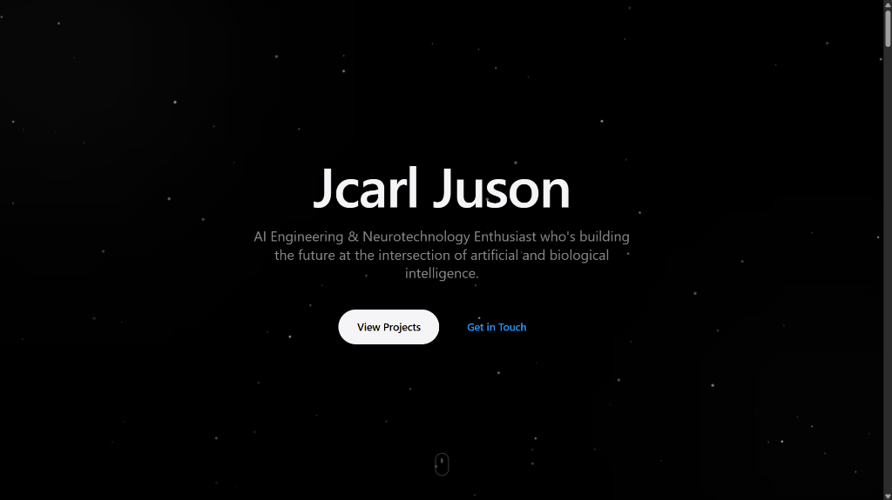
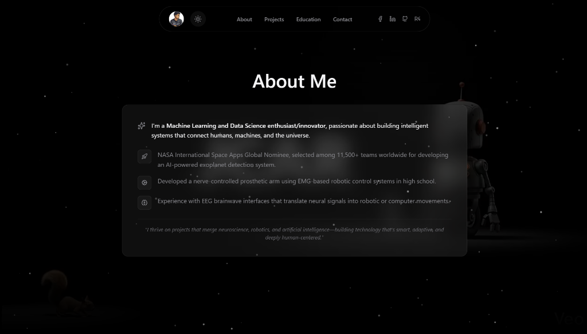
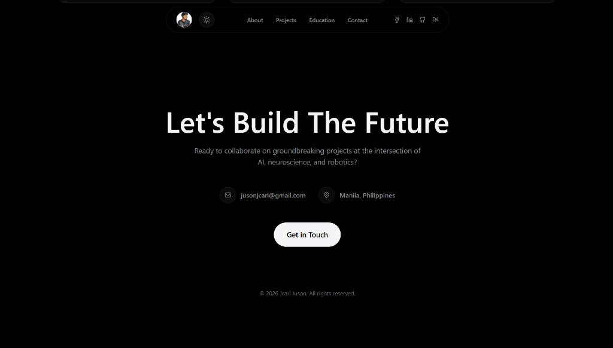

# Interstellar Portfolio

A high-performance, visually stunning portfolio website built for an AI Engineer & Neurotechnologist. Designed with Apple-inspired "liquid glass" aesthetics, deep space cosmology themes, and advanced scroll interactions.



## Tech Stack & Features

*   **Framework:** [Next.js 15 (App Router)](https://nextjs.org/) - React framework for performance and SEO.
*   **Styling:** [Tailwind CSS v4](https://tailwindcss.com/) - Utility-first styling with custom glassmorphism, gradients, and animations.
*   **Animation:** [GSAP (GreenSock)](https://greensock.com/) - Complex scroll triggers, timelines, and physics-based interactions.
*   **Smooth Scroll:** [Lenis](https://lenis.studiofreight.com/) - Butter-smooth scroll interpolation.
*   **Icons:** [Lucide React](https://lucide.dev/) - Clean, consistent vector icons.
*   **Fonts:** SF Pro Display (System fallback) & Inter.

## Key Highlights

### 1. Liquid Glass Navigation
A dynamic, floating navigation bar that mimics the iOS "Dynamic Island". It features:
*   **Frosted Glass Effect:** Uses `backdrop-blur-2xl` with a subtle white glossy border.
*   **Floating Pill Shape:** Detached from the top edge for a modern feel.
*   **Responsive Transition:** Expands and contracts based on scroll position.

### 2. Cylindrical 3D Project Carousel
The **Selected Works** section features a custom 3D rotary carousel powered by GSAP.
*   **Physics-based Interaction:** Cards rotate along a Y-axis curve based on scroll progress.
*   **Dynamic Scaling:** Center card is largest; side cards scaling down and fading out.
*   **Performance:** Uses hardware-accelerated transforms (`translate3d`, `rotateY`) for 60fps performance.



### 3. Smart Light/Dark Mode
A fully adaptive theme engine that preserves the cinematic feel in both modes.
*   **Dark Mode:** Deep space black backgrounds with white text and glowing gold/amber accents.
*   **Light Mode:** Clean white/gray gradients with high-contrast text and "fog" effects, ensuring readability without losing depth.



### 4. Interactive "About Me"
*   **Video Scrubbing:** background video scrubs precisely with scroll position.
*   **Glass Cards:** Content floats on premium frosted glass layers.

## Getting Started

1.  **Clone the repository:**
    ```bash
    git clone https://github.com/jcarljuson/JusonNewPortfolioSite.git
    ```

2.  **Install dependencies:**
    ```bash
    npm install
    ```

3.  **Run the development server:**
    ```bash
    npm run dev
    ```

4.  **Open [http://localhost:3000](http://localhost:3000)** with your browser to see the result.

## Deployment

Deployed on [Vercel](https://vercel.com/new?utm_medium=default-template&filter=next.js&utm_source=create-next-app&utm_campaign=create-next-app-readme).
