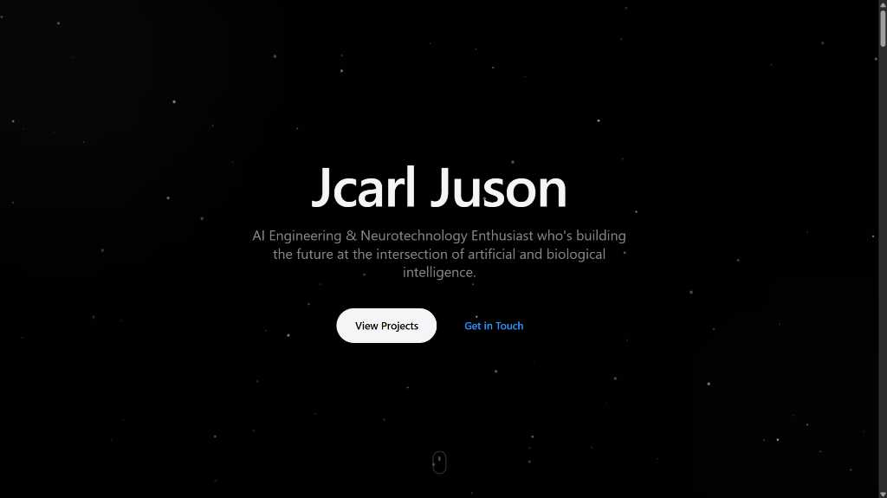

## 🛠️ Tech Stack

*   **Framework:** [Next.js 15 (App Router)](https://nextjs.org/) - React framework for performance and SEO.
*   **Styling:** [Tailwind CSS v4](https://tailwindcss.com/) - Utility-first styling with custom glassmorphism, gradients, and animations.
*   **Animation:** [GSAP (GreenSock)](https://greensock.com/) - Complex scroll triggers, timelines, and physics-based interactions.
*   **Smooth Scroll:** [Lenis](https://lenis.studiofreight.com/) - Butter-smooth scroll interpolation.
*   **Icons:** [Lucide React](https://lucide.dev/) - Clean, consistent vector icons.
*   **Fonts:** SF Pro Display (System fallback) & Inter.

---

## 🚀 Getting Started

1.  **Clone the repository:**
    ```bash
    git clone https://github.com/jcarljuson/JusonNewPortfolioSite.git
    ```

2.  **Install dependencies:**
    ```bash
    npm install
    ```

3.  **Run the development server:**
    ```bash
    npm run dev
    ```

4.  **Open [http://localhost:3000](http://localhost:3000)** with your browser to launch the interface.

---

## 📦 Deployment

Deployed on [Vercel](https://vercel.com/new?utm_medium=default-template&filter=next.js&utm_source=create-next-app&utm_campaign=create-next-app-readme).
